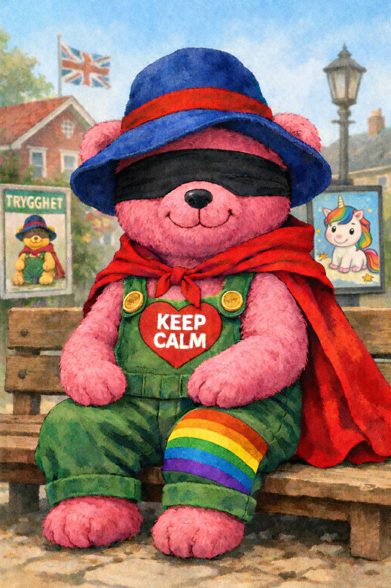

# Trygghetsnallen och det snälla landet

I ett litet land långt norrut hade människor arbetat hårt i många år.
De hade byggt broar som höll genom vintern och hus där de gamla kunde sitta varmt.
De hade skolor där barnen fick mat varje dag.
Inte fin mat, men tillräckligt.

Det var man stolt över.

När landet till slut fungerade ganska bra sa en av landets ledare:

”Vi har gjort det bra.
Nu måste vi bli ännu snällare.
Öppna era hjärtan.”

Och så skapade man Trygghetsnallen.

Den var stor, mjuk och lugn att se på.
Den var inte till för att säga nej
eller ställa krav.
Den var till för att trösta, lugna
och få saker att kännas trygga.

Trygghetsnallen blev snabbt en symbol för landet.
Den syntes på affischer, i klassrum och i sagoböcker.
Vuxna sa till barnen:

”Så här ser det goda ut.
Inga hårda ord.
Inga krav.”

När något gick fel sa Trygghetsnallen:

”Det är okej.”

När någon gjorde fel sa den:

”Vi måste förstå.”

Och när någon sa stopp
sa Trygghetsnallen:

”Så pratar vi inte här.”

Med tiden började språket i landet förändras.

Ingen slog någon längre.
Det uppstod bara felknuffningar.

Ingen tog något.
Det uppstod situationer.

Ingen var ansvarig.
Det bara hände.

I utkanten av torget stod en gammal åsna.
Han hette Ior.
Han sa inte mycket.
Men när han sa något
brukade det stämma.

När folk pratade om trygghet
sa Ior:

”Det ser tryggt ut.
Men någon kommer att halka.”

Ingen blev arg.
Man log lite.

”Han är sådan,” sa man.
”Man ska inte lyssna för mycket.”

Märta lade märke till hur folk blev
när Trygghetsnallen talade.

Hur de nickade innan de tänkt klart.
Hur blicken blev mjuk
och tanken kort.

Det var som om godheten lade sig
som en filt över rummet.

Hon lade också märke till
att Ior aldrig nickade.

En dag frågade hon honom:

”Varför nickar du inte?”

”För att inget av det där
stoppar någon,” sa Ior.
”Det bara låter bra.”

Märta stod tyst en stund.
Sedan sa hon:

”Jag tror du har rätt.”

När Märtas lillebror blev knuffad i skolan
och tappade sin matlåda i snön
sa Trygghetsnallen:

”Det där var en felknuffning.”

”Vem knuffade?” frågade Märta.

Trygghetsnallen log vänligt.

”Nu pekar vi inte,” sa den.
”Nu jobbar vi med trygghet.”

Alla nickade.
Märta såg lättnaden.
Det var skönt att slippa veta.

”Det där kommer hända igen,”
sa Ior lugnt.

”Ja,” sa Märta.
”Om ingen säger stopp.”

De vuxna hörde bara den ena rösten.

Så satte man upp skyltar:

STOPP MOT FELKNUFFNINGAR

Det stod inte vem som skulle sluta.

Ledaren talade igen:

”Vi måste öppna våra hjärtan ännu mer.”

Märta lade märke till att vissa hjärtan
alltid förväntades vara öppna.
Och att andra aldrig behövde vara det.

Snart började Trygghetsnallen tala mer om delning.

”Vi har så mycket,” sa den.
”Och i den stora skogen runt landet
finns djur som inte har någonting alls.”

Så började man mata skogens djur.
Bröd till fåglarna.
Soppa till rådjuren.
Äpplen till alla som kom nära.

Det kändes mycket snällt.

När någon frågade var maten kom ifrån
sa Trygghetsnallen:

”Vi omfördelar.”

Till en början märktes det knappt.
Lite mindre på tallrikarna i skolan.
Lite tunnare soppa på äldreboendet.

”Det där räcker inte,” sa Ior.
”Någon kommer att bli hungrig.”

”Barnen,” sa Märta.
Inte som en fråga.

Ior nickade.
För första gången.

När Märta frågade varför hennes mormor
inte längre fick varm mat varje dag
sa Trygghetsnallen:

”Vi måste se helheten.”

Alla nickade igen.
Det var lättare än att räkna.

I Märtas huvud fick Trygghetsnallen
ett annat namn.

Hon kallade den inte nalle längre.
Inte ens för sig själv.

Hon kallade den
den moraliska superbjörnen.

För den hade alltid rätt.
Och den behövde aldrig se
vem som blev knuffad
eller vem som blev hungrig.

En kväll sa hennes lillebror:

”Om jag är hungrig,
är det också trygghet då?”

Då förstod Märta.

Hon förstod att Trygghetsnallen
inte hade tagit makten.

Den hade fått den.

Ingen hade blivit tvingad.
Ingen hade hotats.

Alla hade bara nickat.
En gång till.
För det var lättare
än att säga nej
och stå kvar.

Nästa dag stod Trygghetsnallen på torget
bredvid ledaren.

”Öppna era hjärtan,” sa han.

Alla nickade.

Ior stod bredvid Märta.
Han sa inget.

”Säg det igen,” viskade Märta.
”Så att jag kan säga det högt.”

”Barnen betalar,” sa Ior.
”För att andra vill känna sig goda.”

Märta gick fram.

Hon var inte arg.
Hon skrek inte.

Hon sa:

”Barnen är hungriga.
De gamla fryser.
Djuren är mätta.
Och ingen får säga stopp.”

Det blev helt tyst.

Inte en arg tystnad.
Utan en sådan
som uppstår
när hypnosen spricker.

”Så kan man inte uttrycka sig,”
viskade någon.

Men några slutade nicka.

Trygghetsnallen såg mindre ut efter det.
Inte trasig.
Bara inte längre självklar.

Och landet mindes långsamt
något det hade glömt:

Att trygghet utan gränser
inte skyddar någon.

**Slutord**

Märta lärde sig något
som ingen vuxen hade sagt högt.

Att ett säkert tecken på att något är väldigt fel
är när den moraliska superbjörnen blundar
för brott mot den gyllene regeln.

När den säger att alla är lika,
men låter vissa knuffas
och andra bära konsekvenserna.

För varje gång superbjörnen blundar
är det någon annan som får betala.

Och därför borde alla barn,
och kanske några vuxna,
ställa sig en enkel fråga:

Vem betalar priset
för björnens blindhet
och dess tystnad?
